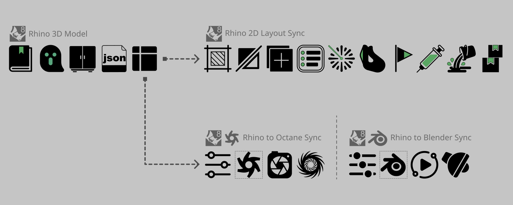

# LoopFlow 系列

> 一套完整的設計工作流——也可以只取你需要的部分。

以 Rhino 3D 模型為單一真實來源，LoopFlow 把專案從 SD（Schematic Design）、經過 DD（Design Development），帶到 CD（Construction Documentation）。同一份模型資料，還能沿兩條路徑往外延伸：

1. **設計與文件** — 在 Rhino 裡走完 SD → DD → CD，從 3D 模型到 2D Layout 圖說　（ [LoopFlow](https://github.com/ChihyuTsai-Oli/LoopFlow) ）
2. **渲染** — Rhino 3D 模型 → [OctaneRender Sync](https://github.com/ChihyuTsai-Oli/LoopFlow_Rhino-to-Octane-Sync)／[Blender Sync](https://github.com/ChihyuTsai-Oli/LoopFlow_Rhino-to-Blender-Sync)

各專案都有詳細說明。若想先看流程概覽，可到 [YouTube 播放清單](https://www.youtube.com/@Chihyu-Oli/playlists)。

---

我是建築及室內設計師。
這裡的一切都在 AI 協助下完成。
